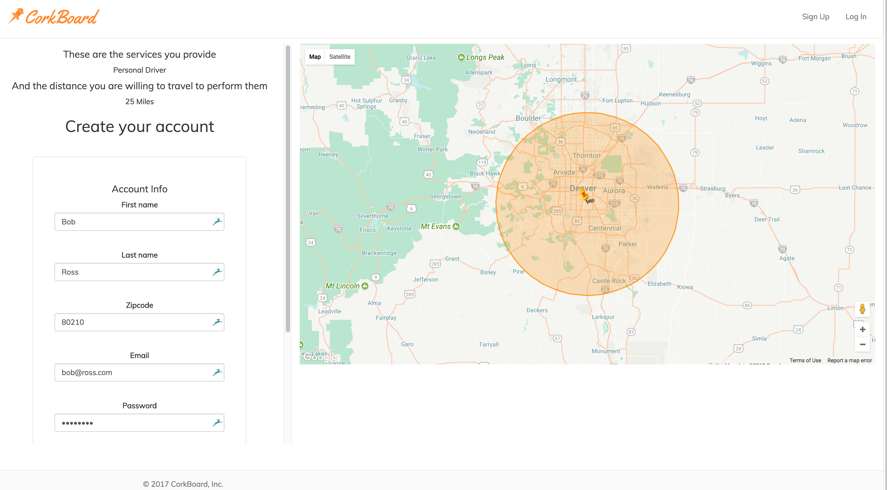

## Consider It Done 

Live production site available [here](https://corkboard-services.herokuapp.com/)

Corkboard was a contribution to the cloney-island project in which our team was tasked with recreating a modern website in two stages. The first being a two week sprint where the foundation is laid by [team one](git@github.com:NicholasJacques/corkboard.git). This current iteration is the result of the second sprint where our team took over the unfamiliar code base and expanded functionality. Some of those features include:

The inspiration for this project was [Thumbtack](https://www.thumbtack.com/).

### The Stack
* React
* JQuery
* JavaScript
* Ruby
* Rails 5.0.4
* Redis
* AWS Bucket
* MongoDB
* PostgreSQL

#### To Run Locally
* Clone down this repo  
* `cd corkboard`
* Run `bundle`
* Run `rake db:setup`
* Rrun `rails s`.
* Visit `localhost:3000` and start exploring corkboard
* Type `ctrl-c` to stop the server and return to the command line.

### Typical Flow
From the homepage a user may begin by typing a needed service into the searchbar. A query like "plumbing", "electrical", or "driver" will bring up search results that can be followed to create an event. User can also click the icons below to navigate lists of services. Onece a service is chosen users can fill out a form to create a post. In order to fufill this request one has to sign in or sign up. We offer OAuth through facebook or a typical username/email login. From there a user will be taken to a dashboard where the can see all open, accepted and past bid projects with action options on those projects. If clicked, a project will show all active bids on that project and if those are clicked will take a user to the bids page:

From here users can converse with the professional who extended the bid via the chatbox to the lower right(these happen in real time and are served by ActionCable and Redis). From here bids can be accepted and withdrawn. Once a project is closed a user has the ability to rate professionals on a 5-star scale.

Professionals can also sign up using the signup link, but choose an alternate route. From there they are asked to further narrow down and specifiy their services and their work radius from a particular zipcode. This is then displayed on a map during signup:

Once logged in, a pro dashboard allows for the viewing of all open, acceted and closed bids. If a pro clicks "find projects" from the dashboard they are taken to a list where they will see only jobs related to their offered service within their prescribed radius. They can bid directly from this page and a modal will pop up allowing them to write a short message to the prospective employer. 

### Highlighted Features and Technologies

#### Action Cable
When a Professional submits a bid for a project, a real-time chat messaging system is initialized on the bid. Messaging uses Rails' built-in ActionCable module in conjunction with a Redis server in order to enable a chat channel scoped to the specific bid

#### Asynchronous JavaScript
In the User's dashboard, users can manage their projects. Projects are rendered via AJAX calls to an internal API. Accepted projects can be marked as "Complete." This functionality is also provided by AJAX calls to an internal API, secured by an encoded JWS token. Click on a completed project to leave a review for the pro.

#### React Homepage and Browser
The homepage and browser pages are built using React. The serach bar on the landing page call an [external Rails application](https://github.com/Benjaminpjacobs/corkboard-micro) running MongoDB which holds all potential result values. When you begin typing in the search bar for a service clickable results will auto populate in the space below. When clicked you will be directed to further specified results or to a form to create a job post. The external service is updated via a Rails Active Job and also secured using JavaScript Web Tokens. 
