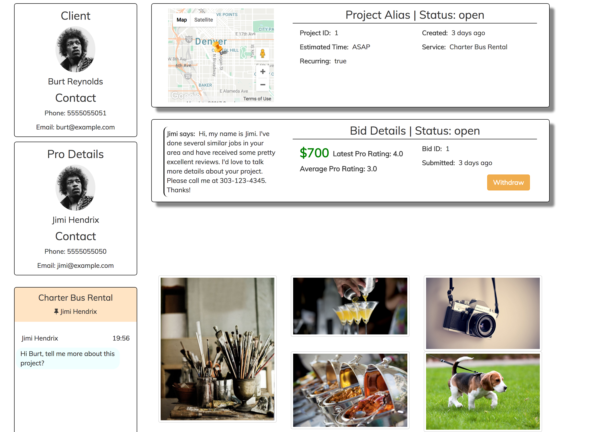

## Consider It Done

Corkboard was a contribution to the cloney-island project in which we were tasked with recreating a modern website in two stages. The first being a two week sprint where the foundation is laid by [team one](git@github.com:NicholasJacques/corkboard.git). This current iteration is the result of the second sprint where our team took over the unfamiliar code base and expanded functionality. Some of those features include:

The inspiration for this project was [Thumbtack](https://www.thumbtack.com/).

Our stack includes:
- React
- JQuery
- JavaScript
- Ruby
- Rails 5.0.4
- Redis
- AWS Bucket
- MongoDB
- PostgreSQL

## To Try the project yourself:
In Terminal
- Clone this repo into that directory
- `cd corkboard`
- Run `bundle`
- Finally, run `rake db:setup to setup and seed your database`

### RSpec test suite and Checking Coverage with SimpleCov

Start by running our test suite.

  * Enter `rspec` on the command line to run the test suite.
  * Next, enter `open coverage/index.html` on the command line to see test coverage.

### Running the server locally

  * To start up the server from within the project, run `rails s`.
  * Then, visit your browser and start exploring!
  * Type `ctrl-c` to stop the server and return to the command line.

### Features

#### Action Cable
When a Professional submits a bid for a project, a real-time chat messaging system is initialized on the bid. Messaging uses Rails' built-in ActionCable module in conjunction with a Redis server in order to enable a chat channel scoped to the specific bid. To use, login as a Pro, find a project, create a bid and chat away.

#### Asynchronous JavaScript
In the User's dashboard, users can manage their projects. Projects are rendered via AJAX calls to an internal API. Accepted projects can be marked as "Complete." This functionality is also provided by AJAX calls to an internal API, secured by an encoded JWS token. Click on a completed project to leave a review for the pro.

#### Capistrano
Capistrano was used to manage deployments to a Google Cloud Platform Server. Capistrano takes care of pulling from the branch you specify to the server, bundling without Development/Test gems, and running database migrations it will then compile all assets and restart the puma server. The deploy script can be linked to a Travis or Jenkins CI so every successfull test it deploys automatically. It can also be configured to deploy to multiple servers to support scaling. 

#### React Homepage 
The homepage and browser page are built using React. The serach bar on the landing page call an external Rails application running MongoDB which holds all potential result values. When you begin typing in the search bar for a service clickable results will auto populate in the space below. When clicked you will be directed to further specified results or to a form to create a job post. The external service is updated via a Rails Active Job and also secured using JavaScript Web Tokens. 
